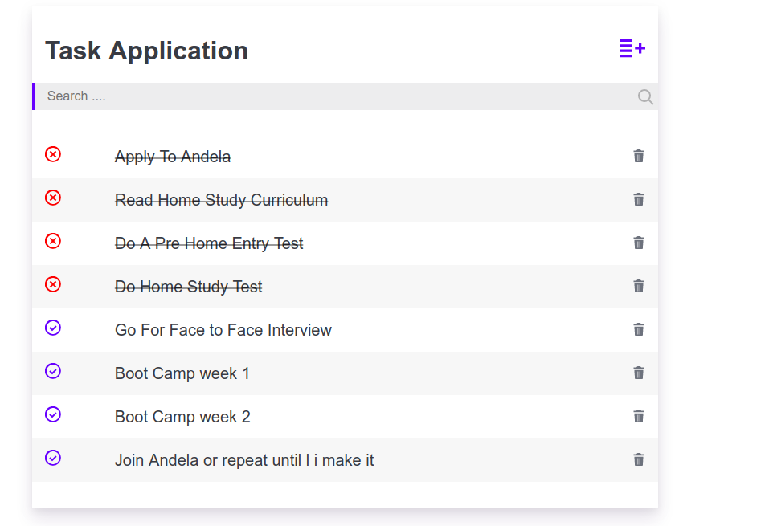

## React Task App

## A Simple Task App

A working demo is found here [Simple Task App](https://krmroland.github.io/react-task-app/)

This is a throw away project bootstrapped with create-react app.

This was my first time writing a react application but it was fun hanging around.

I also wanted to try out Continuous Integration with Travis CI

The project uses redux as a state management pattern and `window.localStorage` for persistence
